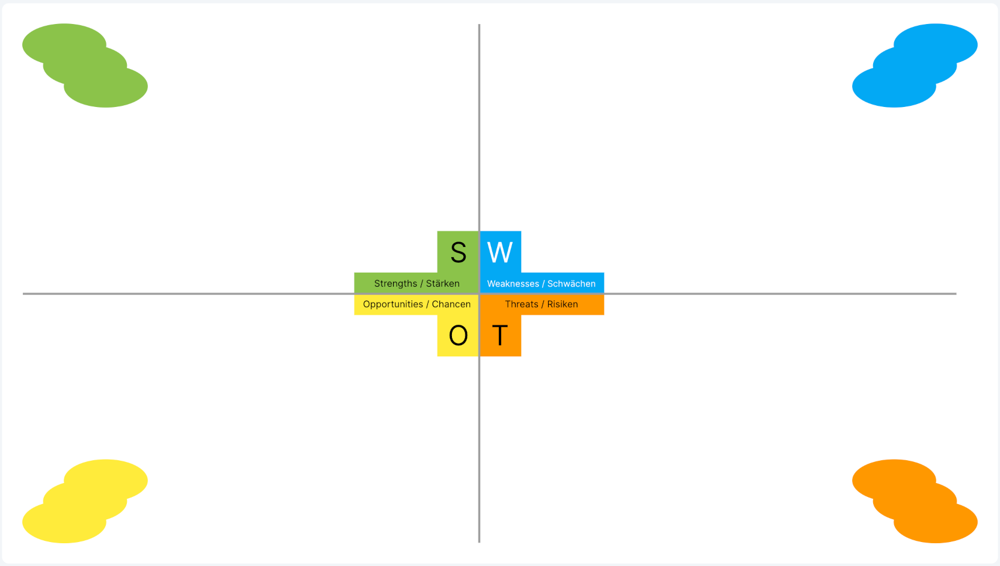

# NeoBoard


[](https://matrix.to/#/#nordeck:matrix.org)

A collaborative whiteboard widget for Element, based on [Matrix](https://matrix.org).
Use it to collaborate in real-time with your peers, by keeping full control of your data and keep it secure with end-to-end encryption.

<table>
  <tr>
    <td colspan="4">
      
    </td>
  </tr>
  <tr>
    <td>
      
    </td>
    <td>
      
    </td>
    <td>
      
    </td>
    <td>
      
    </td>
  </tr>
</table>

All data is stored in the Matrix rooms. Learn more about the architecture in the [Model](./docs/model) or the [Architecture Decision Records](./docs/adrs).

## Usage

NeoBoard is a Matrix widget, which can be added to a chat room to extend the client feature set with a whiteboard.
Currently, [Element Web](https://app.element.io), version `1.11.8` or later, is the only known client that supports widgets.

> [!NOTE]
> Beyond that, NeoBoard supports real time collaboration between users sharing the same chat room, and therefore requires working WebRTC connections between all participants. Most servers including Matrix.org support this, but you can read more about it [here](#important-notes).

> [!IMPORTANT]
> NeoBoard stores its data in Matrix rooms. Depending on the amount of content on your whiteboard, it needs to send multiple hidden messages to save it. The amount of messages is larger than many servers allow. We therefore currently recommend you use NeoBoard with your own server and a [tweaked configuration](./docs/configuration.md#rate-limiting-settings).

### Demo

[Click here](https://nordeck.github.io/matrix-neoboard) and follow the instructions to see it in action and experience it yourself.
You need at least Moderator permissions (power level >50) in the room so it might be a good idea to test it in a new Matrix room at first.

This is only a demo deployment that is not suited for production use.
See the [Deployment](#deployment) section on how you can host the widget on your own.

> 💡 Import the [NeoBoard quick start pack](./docs/NeoBoard%20QuickStart%20Pack.nwb) for some demo content to get started right away.

## Development

Development on the widget happens at [GitHub](https://github.com/nordeck/matrix-neoboard).

### How to Contribute

Please take a look at our [Contribution Guidelines](https://github.com/nordeck/.github/blob/main/docs/CONTRIBUTING.md).
Check the following steps to develop for the widget:

### Requirements

You need to install Node.js (`>= 20.0.0`, prefer using an LTS version) and run
`yarn` to work on this package.
The minimal Element version to use this widget is `1.11.8`.

### Dependencies

After checkout, run `yarn install` to download the required dependencies

> [!WARNING]
> Do not use `npm install` when working with this package.

### Configuration

Rename the provided `.env.local.default` to `.env.local` and fill it with your configuration.
For a list of available options, see [Configuration](./docs/configuration.md).

### Running the Widget Locally

Follow the [instructions to run the widget locally](https://github.com/nordeck/matrix-widget-toolkit/tree/main/example-widget-mui#running-the-widget-locally).
Visit the widget url follow the further instructions: `http://localhost:5273/` or `https://localhost:5274/` .

### Running with a local version of the matrix-widget-toolkit

If changes inside matrix-widget-toolkit are required or for debugging purposes,
you can clone the repos next to each other and link the packages with `yarn link`:

```
ls
matrix-neoboard
matrix-widget-toolkit
```

Then yarn link the required matrix-widget-toolkit packages, for example:

```
cd matrix-widget-toolkit
yarn install
cd packages/api
yarn link
cd ../../../matrix-neoboard
yarn link @matrix-widget-toolkit/api
yarn install
```

### Available Scripts

In the project directory, you can run:

- `yarn dev`: Start the widget for development.
- `yarn dev:https`: Start the widget for development with a self-signed HTTPS certificate.
- `yarn build`: Build the production version of the widget.
- `yarn preview`: Preview a production build of the widget.
- `yarn preview:https`: Preview a production build of the widget with a self-signed HTTPS certificate.
- `yarn test`: Watch all files for changes and run tests.
- `yarn tsc`: Check TypeScript types for errors in the widget.
- `yarn lint`: Run eslint on the widget.
- `yarn prettier:write`: Run prettier on all files to format them.
- `yarn depcheck`: Check for missing or unused dependencies.
- `yarn deduplicate`: Deduplicate dependencies in the `yarn.lock` file.
- `yarn changeset`: Generate a changeset that provides a description of a
  change.
- `yarn translate`: Update translation files from code.
- `yarn generate-disclaimer`: Generates license disclaimer and include it in the build output.
- `yarn docker:build`: Builds a container from the output of `yarn build` and `yarn generate-disclaimer`.
- `yarn docker:run`: Runs the container and serves the widget at [http://localhost:3000](http://localhost:3000).

### Versioning

This package uses automated versioning.
Each change should be accompanied by a specification of the impact (`patch`, `minor`, or `major`) and a description of the change.
Use `yarn changeset` to generate a new changeset for a pull request.
Learn more in the [`.changeset` folder](./.changeset).

Once the change is merged to `main`, a “Version Packages” pull request will be created.
As soon as the project maintainers merged it, the package will be released and the container is published.

### Architecture Decision Records

We use [Architecture Decision Records (ADR)s](https://github.com/nordeck/matrix-widget-toolkit/blob/main/docs/adrs/adr001-use-adrs-to-document-decisions.md) to document decisions for our software.
You can find them at [`/docs/adrs`](./docs/adrs/).

## Deployment

Yon can run the widget using Docker:

```sh
docker run --rm -e REACT_APP_HOME_SERVER_URL=https://matrix-client.matrix.org -p 8080:8080 ghcr.io/nordeck/matrix-neoboard-widget:latest
```

To run IPv4 please take a look at <https://github.com/nordeck/matrix-widget-toolkit/tree/main/containers/widget-server#custom-listen-directive>

We also provide a [HELM chart](./charts/).

### Important notes

**TURN server**

The real time collaboration features require you to configure TURN servers in your Homeserver.
While it might appear like NeoBoard still works without them, it will be missing some features and other features might start behaving unexpectedly.
Running in an environment without TURN is currently not supported.
The official matrix.org homeserver will work; see for example how to configure them for [Synapse](https://matrix-org.github.io/synapse/latest/turn-howto.html).

**Rate limiting settings**

For a good NeoBoard experience we highly recommend to tweak the rate limiting settings as described in the [configuration](./docs/configuration.md#rate-limiting-settings).
Otherwise users may get stuck in a state where they need to confirm to re-send messages before NeoBoard resumes to work normally after it ran into rate limiting.

## Verify the Container Images

The container images releases are signed by [cosign](https://github.com/sigstore/cosign) using identity-based ("keyless") signing and transparency.
Execute the following command to verify the signature of a container image:

```sh
cosign verify \
--certificate-identity-regexp https://github.com/nordeck/matrix-neoboard/.github/workflows/publish-release.yml@refs/tags/v \
--certificate-oidc-issuer https://token.actions.githubusercontent.com \
ghcr.io/nordeck/matrix-neoboard-widget:<version> | jq
```

## License

This project is licensed under [APACHE 2.0](./LICENSE).

The disclaimer for other OSS components can be accessed via the `/NOTICE.txt` endpoint.
The list of dependencies and their licenses are also available in a machine readable format at `/usr/share/nginx/html/licenses.json` in the container image.

## Sponsors

<p align="center">
   <a href="https://www.dphoenixsuite.de/"></a>
   &nbsp;&nbsp;&nbsp;&nbsp;
   <a href="https://www.dataport.de/"></a>
   &nbsp;&nbsp;&nbsp;&nbsp;
   <a href="https://www.nordeck.net/"></a>
</p>

This project is part of the [dPhoenixSuite by Dataport](https://www.dphoenixsuite.de/).
